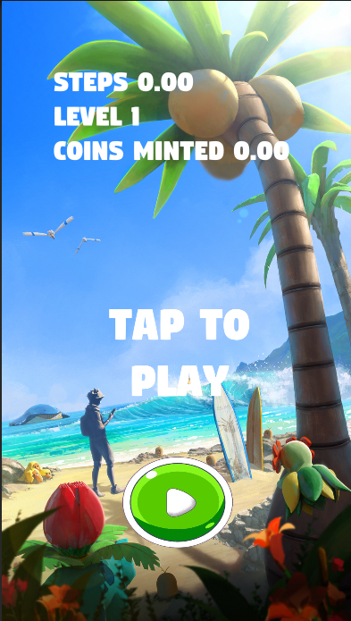
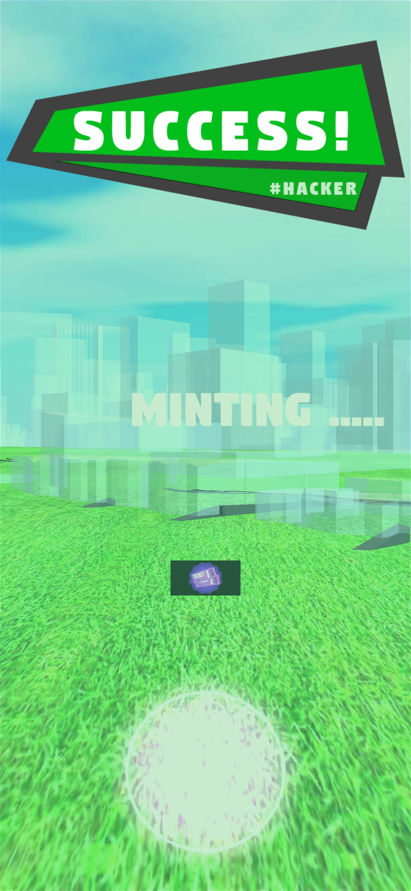
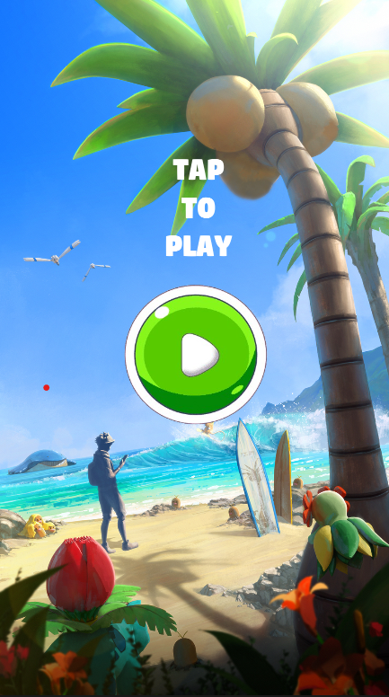
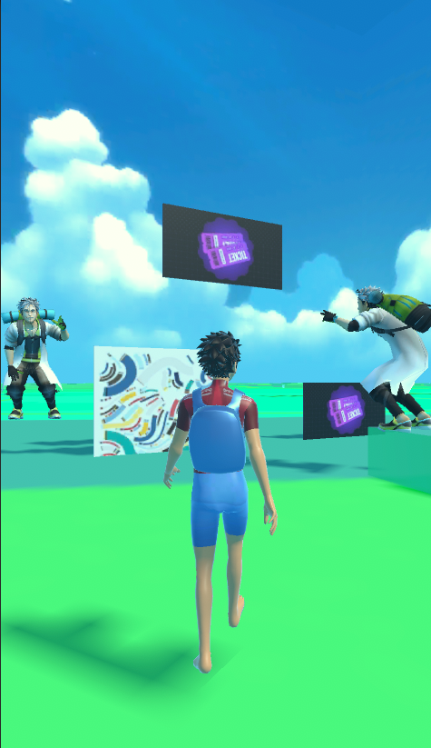

# CryptoRunner by WalkupLabs

CryptoRunner Project by WalkupLabs

A next-gen geo-tagged playground where players meet opportunities offered with a timeless technology. Map-based gameplay with capabilities to engage players and provide market visibility to communities and businesses.

## How to Install CryptoRunner
1) Download the APK [CryptoRunner](https://drive.google.com/file/d/1q7QliU5QGQrBvXwHT9VpXo1Bg9AG1yw0/view?usp=sharing) and Install it please provide geolocation and physical activity access to run smoothly

2) Catch all the NFTs

## Deployed Contract Address
SOLANA DEVNET https://explorer.solana.com/tx/2f9zHDt8DE6MGsyDkP7fXzvqrYheK4EmfttPBx4NbqydKJSnUfiNTHvYRW8Q6qvAnfueaPtKt8omovsKaXtWuZ8f?cluster=devnet

## Screenshot of Project 

